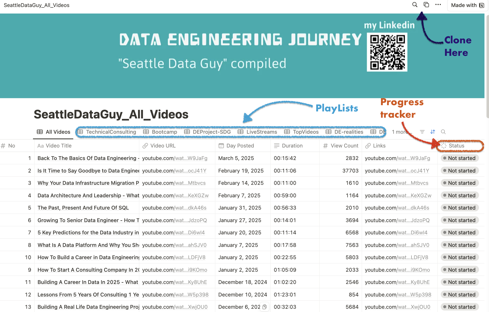

# SDG-WatchList-Tracker

This repo will be regularly updated as new videos come in from Seattle Data Guy.

### Watch list tracker

- Video watch list tracker can be cloned at this [link](https://btkh.notion.site/1b3f08abbb9780deb59dde08e143962c?v=1b3f08abbb9781d7a330000ca70d6a72).
- The Image below shows the video list tracker:



### Value of added:

The notion template can be used to:

- `document` your learning.
- `track` your `progress`.
- If you are new to DE, gives you some gist into data ingestion from API and simple transformation.

#

### How to test the code for yourself

- create your api key for YouTube at `Google Cloud Console API`.
- store your api key in a `key.config` file to avoid public access.

- Setup virtual environment with [`pipenv`](https://pipenv.pypa.io/en/latest/installation.html)

- Install python packages listed in `Pipfile` by running :

  ```
  pipenv install
  ```

- run the python code to ingest and transform data:

  ```
   python pull4.py
  ```

### Result

- the code will pull data from Youtube API & exporeted into `seattle_data_guy_checklist2.xlsx` xlsx (Excel) file.
